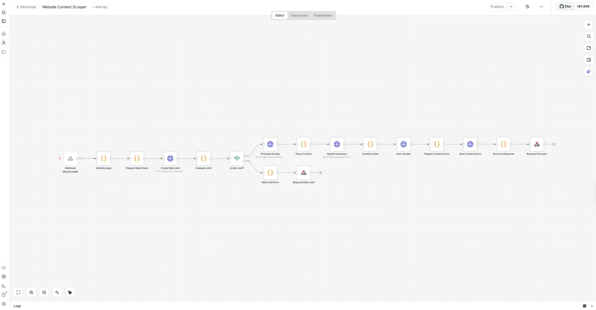

# Website Content Scraper

> **Generative AI Mastermind · Session 3 · Outskill · January 2026**  
> Lamonte Smith




---A production-quality web scraping API built in n8n that accepts a URL, scrapes it using Firecrawl, extracts structured content, generates an AI summary via GPT-4o-mini, and stores everything in Supabase — with per-user rate limiting and full input validation on every request.

---

## Architecture

```
POST /scrape-website
        │
        ▼
┌─────────────────────┐
│   Validate Input    │
│  URL format + userId│
└──────────┬──────────┘
           │
           ▼
┌─────────────────────┐
│  Check Rate Limit   │
│  Supabase query     │
│  max 10/hour/user   │
└──────────┬──────────┘
           │
    ┌──────┴──────┐
    ▼             ▼
Under Limit?   Rate Limit
    │          Error (429)
    ▼
┌─────────────────────┐
│  Firecrawl Scrape   │
│  markdown + HTML    │
└──────────┬──────────┘
           │
           ▼
┌─────────────────────┐
│   Parse Content     │
│ title, headings,    │
│ links, word count   │
└──────────┬──────────┘
           │
           ▼
┌─────────────────────┐
│   OpenAI Summary    │
│   GPT-4o-mini       │
│   3-4 sentences     │
└──────────┬──────────┘
           │
           ▼
┌─────────────────────┐
│    Save to Supabase │
│  scrapes table +    │
│  scraped_content    │
└──────────┬──────────┘
           │
           ▼
   HTTP 200 Success
```

---

## Key Features

- **Rate limiting** — 10 scrapes per hour per user; HTTP 429 with retry-after on breach
- **Input validation** — URL format regex, userId required, validated before any downstream calls
- **Structured extraction** — title, headings (up to 50), links (up to 100, internal/external classified), word count
- **AI summarization** — GPT-4o-mini generates a 3-4 sentence summary of page content
- **Normalized storage** — scrape record and individual content items stored in separate Supabase tables
- **Clean API responses** — success returns scrapeId, stats, and summary; errors return structured JSON

---

## Tech Stack


**Scraping:** Firecrawl API  
**Summarization:** OpenAI GPT-4o-mini  
**Storage:** Supabase (PostgreSQL)  
**Rate Limiting:** Per-user sliding window via Supabase query  
**Patterns:** Webhook API · Input Validation · Rate Limiting · AI Summarization · Normalized Storage

---

## API Usage

```bash
curl -X POST https://<your-n8n-instance>/webhook/scrape-website \
  -H "Content-Type: application/json" \
  -d '{
    "url": "https://example.com",
    "userId": "user-123"
  }'
```

**Success Response (HTTP 200):**
```json
{
  "success": true,
  "data": {
    "scrapeId": "uuid",
    "url": "https://example.com",
    "title": "Page Title",
    "summary": "AI-generated summary...",
    "stats": {
      "wordCount": 850,
      "headingCount": 12,
      "linkCount": 34,
      "internalLinkCount": 18,
      "externalLinkCount": 16
    },
    "scrapedAt": "2026-01-15T10:30:00Z"
  }
}
```

**Rate Limit Response (HTTP 429):**
```json
{
  "success": false,
  "error": "Rate limit exceeded",
  "message": "You have made 10 scrapes in the last hour. Maximum allowed is 10.",
  "retryAfter": "1 hour",
  "maxAllowed": 10
}
```

---

## Environment Variables

```bash
SUPABASE_URL=           # Required: Supabase project URL
SUPABASE_SERVICE_KEY=   # Required: Supabase service role key
FIRECRAWL_API_KEY=      # Required: Firecrawl API key
OPENAI_API_KEY=         # Required: OpenAI API key
```

> ⚠️ Never commit actual values. Use n8n environment variable management.

---

## Academic Context

| Field | Detail |
|-------|--------|
| Program | Generative AI Mastermind |
| Institution | Outskill |
| Session | Session 3 — Custom GPTs, AI Bots & Agentic AI |
| Completed | January 2026 |

---

## Repository Structure

```
website-content-scraper/
├── workflow/
│   └── website-content-scraper.json
├── docs/
│   └── PRD.docx
├── SECURITY.md
└── README.md
```

---

## License

MIT License — see [LICENSE](LICENSE)

---

<div align="center">
<sub>Built by <a href="https://github.com/LSmithPMP">Lamonte Smith</a> · Outskill — Generative AI Mastermind · January 2026</sub>
</div>
